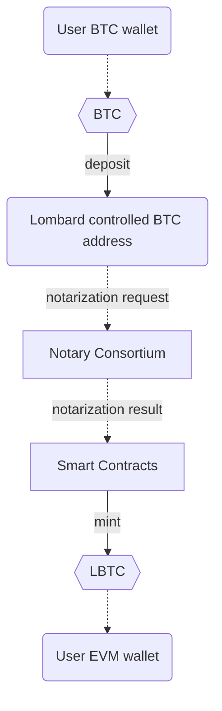
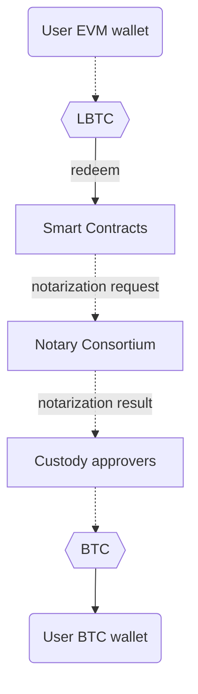

<div>
    
    
    =18-node.js-green">
    =4.5.0-typescript-blue">
    
    
</div>

<div>
    
</div>

# Lombard Finance EVM smart-contracts
[Website](https://www.lombard.finance/) | [Docs](https://docs.lombard.finance/)

## Content
1. [Overview](https://github.com/lombard-finance/evm-smart-contracts?tab=readme-ov-file#overview)
2. [One-time setup](https://github.com/lombard-finance/evm-smart-contracts?tab=readme-ov-file#one-time-setup)
3. [Deployment](https://github.com/lombard-finance/evm-smart-contracts?tab=readme-ov-file#deployment)
4. [Audit](https://github.com/lombard-finance/evm-smart-contracts?tab=readme-ov-file#audit)
5. [Misc](https://github.com/lombard-finance/evm-smart-contracts?tab=readme-ov-file#misc)

## Overview
LBTC is liquid Bitcoin; it's yield-bearing, cross-chain, and 1:1 backed by BTC. LBTC enables yield-bearing BTC to move cross-chain without fragmenting liquidity, and is designed to seamlessly integrate Bitcoin into the decentralized finance (DeFi) ecosystem while maintaining the security and integrity of the underlying asset.

| Smart contract   | Description                                                                                                                            |
|------------------|----------------------------------------------------------------------------------------------------------------------------------------|
| Bascule          | Bascule drawbridge designed to prevent bridge hacks before they hit the chain.                                                         |
| Consortium       | The contract utilizes notary consortium multi-signature verification.                                                                  |
| LombardTimelock  | Safeguard helps to perform delayed transactions (e.g. implementation upgrade).                                                         |
| LBTC             | ERC20 token to interact with protocol.                                                                                                 |
| GnosisSafeProxy  | Lombard governance, pauser and treasury wallets.                                                                                       |      
| Bridge           | Lombard multi-factor bridge. Supports different adapters (like [CCIP](https://docs.chain.link/ccip) as second factor to bridge `LBTC`. |
| OFTAdapters      | LayerZero adapters for `LBTC` with different strategies.                                                                               |
| ProxyFactory     | CREATE3 factory allows to deploy proxies with same address.                                                                            |
| FBTCPartnerVault | Allows to stake `FBTC` token.                                                                                                          |
| PMMs             | Swap pools to accept wrapped BTC ERC20 tokens (like `cbBTC` and `BTCb`).                                                               |
| PoR              | Bitcoin addresses storage with the ownership proof system.                                                                             |
| StakeAndBake     | Convenience contract for users who wish to stake their `BTC` and deposit `LBTC` in a vault in the same transaction.                    |
| BARD             | ERC20 governance token.                                                                                                                |


### BTC deposit flow
Graph below represents BTC to LBTC flow



### BTC redeem flow
Graph below represents LBTC to BTC flow


## One-time setup

Install [nodejs](https://nodejs.org/en/download/package-manager). Run node -v to check your installation.

Support Node.js 18.x and higher.

### 1. Clone this repo:
```bash
git clone https://github.com/lombard-finance/evm-smart-contracts.git
```
### 2. Install dependencies
```bash
yarn
```

### 3. Compile smart contracts

```bash
yarn hardhat compile
```

### 4. Run tests

```bash
yarn hardhat test
```

## Deployment

Learn available scripts:
```bash
yarn hardhat
```

* `deploy-*` - scripts to deploy smart-contracts.
* `setup-*` - scripts to setup or change configuration of smart-contracts.
* `upgrade-proxy` - script to upgrade existing proxy with new implementation.

## Audit

Find the latest audit reports in [docs/audit](https://github.com/lombard-finance/evm-smart-contracts/tree/main/docs/audit)

## Misc

Follow [docs](https://github.com/lombard-finance/evm-smart-contracts/tree/main/docs) in more in-depth study of contracts.

<!-- AUDIT_DOSSIER_START -->
## Protocol State/Value Dossier (Auto-Generated)

Generated (UTC): `2026-05-26T16:59:52Z`  
Project: `12_lombard-finance`  
Solidity files: `96`

### Structure
Top Solidity directories:
- `contracts`: 96 `.sol` files

Pragmas:
- `0.8.24`
- `>=0.8.0`
- `^0.8.0`
- `^0.8.10`
- `^0.8.19`
- `^0.8.21`
- `^0.8.4`

Contracts/Libraries/Interfaces detected: `106`

### Life Total / Balance Values
Detected accounting/state total variables:
- `ASSETS_MODULE_ADDRESS` | type: `bytes32 public constant` | vis: `public` | flags: `constant` | `Assets` @ `contracts/LBTC/libraries/Assets.sol` = `bytes32(uint256(0x008bf729ffe074caee622c02928173467e658e19e2))`
- `BTC_STAKING_MODULE_ADDRESS` | type: `bytes32 public constant` | vis: `public` | flags: `constant` | `Assets` @ `contracts/LBTC/libraries/Assets.sol` = `bytes32(uint256(0x0089e3e4e7a699d6f131d893aeef7ee143706ac23a))`
- `_balances` | type: `mapping(address => uint256) private` | vis: `private` | flags: `-` | `BTCBMock` @ `contracts/mock/BTCBMock.sol`
- `_totalSupply` | type: `uint256 private` | vis: `private` | flags: `-` | `BTCBMock` @ `contracts/mock/BTCBMock.sol`
- `tokenPool` | type: `LombardTokenPool public` | vis: `public` | flags: `-` | `CLAdapter` @ `contracts/bridge/adapters/CLAdapter.sol`
- `depositAsset` | type: `IERC20 public immutable` | vis: `public` | flags: `immutable` | `ERC4626Depositor` @ `contracts/stakeAndBake/depositor/erc4626/ERC4626Depositor.sol`
- `stakeAndBake` | type: `address public immutable` | vis: `public` | flags: `immutable` | `ERC4626Depositor` @ `contracts/stakeAndBake/depositor/erc4626/ERC4626Depositor.sol`
- `vault` | type: `IERC4626 public immutable` | vis: `public` | flags: `immutable` | `ERC4626Depositor` @ `contracts/stakeAndBake/depositor/erc4626/ERC4626Depositor.sol`
- `PARTNER_VAULT_STORAGE_LOCATION` | type: `bytes32 private constant` | vis: `private` | flags: `constant` | `FBTCPartnerVault` @ `contracts/fbtc/PartnerVault.sol` = `0xf2032fbd6c6daf0509f7b47277c23d318b85e97f8401e745afc792c2709cec00`
- `STAKE_AND_BAKE_STORAGE_LOCATION` | type: `bytes32 private constant` | vis: `private` | flags: `constant` | `StakeAndBake` @ `contracts/stakeAndBake/StakeAndBake.sol` = `0xd0321c9642a0f7a5931cd62db04cb9e2c0d32906ef8824eece128a7ad5e4f500`
- `STAKE_AND_BAKE_STORAGE_LOCATION` | type: `bytes32 private constant` | vis: `private` | flags: `constant` | `StakeAndBakeNativeToken` @ `contracts/stakeAndBake/StakeAndBakeNativeToken.sol` = `0x0e47f6bdb2c8c295db7a485b9611b576c67616f4bb0fcb676c069d08170f1800`
- `depositAsset` | type: `IERC20 public immutable` | vis: `public` | flags: `immutable` | `TellerWithMultiAssetSupportDepositor` @ `contracts/stakeAndBake/depositor/veda/TellerWithMultiAssetSupportDepositor.sol`
- `stakeAndBake` | type: `address public immutable` | vis: `public` | flags: `immutable` | `TellerWithMultiAssetSupportDepositor` @ `contracts/stakeAndBake/depositor/veda/TellerWithMultiAssetSupportDepositor.sol`
- `vault` | type: `address public immutable` | vis: `public` | flags: `immutable` | `TellerWithMultiAssetSupportDepositor` @ `contracts/stakeAndBake/depositor/veda/TellerWithMultiAssetSupportDepositor.sol`
- `assetData` | type: `mapping(ERC20 => Asset) public` | vis: `public` | flags: `-` | `TellerWithMultiAssetSupportMock` @ `contracts/mock/TellerWithMultiAssetSupportMock.sol`

All detected state variables (full list):
- `bridge` | type: `IBridge public override` | vis: `public` | flags: `override` | `AbstractAdapter` @ `contracts/bridge/adapters/AbstractAdapter.sol`
- `ABI_SLOT_SIZE` | type: `uint256 internal constant` | vis: `internal` | flags: `constant` | `Actions` @ `contracts/libs/Actions.sol` = `32`
- `DEPOSIT_BRIDGE_ACTION` | type: `bytes4 internal constant` | vis: `internal` | flags: `constant` | `Actions` @ `contracts/libs/Actions.sol` = `0x5c70a505`
- `DEPOSIT_BTC_ACTION_V0` | type: `bytes4 internal constant` | vis: `internal` | flags: `constant` | `Actions` @ `contracts/libs/Actions.sol` = `0xf2e73f7c`
- `DEPOSIT_BTC_ACTION_V1` | type: `bytes4 internal constant` | vis: `internal` | flags: `constant` | `Actions` @ `contracts/libs/Actions.sol` = `0xce25e7c2`
- `FEE_APPROVAL_ACTION` | type: `bytes4 internal constant` | vis: `internal` | flags: `constant` | `Actions` @ `contracts/libs/Actions.sol` = `0x8175ca94`
- `FEE_APPROVAL_EIP712_ACTION` | type: `bytes32 internal constant` | vis: `internal` | flags: `constant` | `Actions` @ `contracts/libs/Actions.sol` = `0x40ac9f6aa27075e64c1ed1ea2e831b20b8c25efdeb6b79fd0cf683c9a9c50725`
- `MAX_VALIDATOR_SET_SIZE` | type: `uint256 private constant` | vis: `private` | flags: `constant` | `Actions` @ `contracts/libs/Actions.sol` = `102`
- `MIN_VALIDATOR_SET_SIZE` | type: `uint256 private constant` | vis: `private` | flags: `constant` | `Actions` @ `contracts/libs/Actions.sol` = `1`
- `NEW_VALSET` | type: `bytes4 internal constant` | vis: `internal` | flags: `constant` | `Actions` @ `contracts/libs/Actions.sol` = `0x4aab1d6f`
- `RATIO_UPDATE` | type: `bytes4 internal constant` | vis: `internal` | flags: `constant` | `Actions` @ `contracts/libs/Actions.sol` = `0x6c722c2c`
- `CALLER_ROLE` | type: `bytes32 public constant` | vis: `public` | flags: `constant` | `AssetRouter` @ `contracts/LBTC/AssetRouter.sol` = `keccak256("CALLER_ROLE")`
- `CLAIMER_ROLE` | type: `bytes32 public constant` | vis: `public` | flags: `constant` | `AssetRouter` @ `contracts/LBTC/AssetRouter.sol` = `keccak256("CLAIMER_ROLE")`
- `OPERATOR_ROLE` | type: `bytes32 public constant` | vis: `public` | flags: `constant` | `AssetRouter` @ `contracts/LBTC/AssetRouter.sol` = `keccak256("OPERATOR_ROLE")`
- `ABI_SLOT_SIZE` | type: `uint256 internal constant` | vis: `internal` | flags: `constant` | `Assets` @ `contracts/LBTC/libraries/Assets.sol` = `32`
- `ASSETS_MODULE_ADDRESS` | type: `bytes32 public constant` | vis: `public` | flags: `constant` | `Assets` @ `contracts/LBTC/libraries/Assets.sol` = `bytes32(uint256(0x008bf729ffe074caee622c02928173467e658e19e2))`
- `BITCOIN_NATIVE_COIN` | type: `bytes32 public constant` | vis: `public` | flags: `constant` | `Assets` @ `contracts/LBTC/libraries/Assets.sol` = `bytes32(uint256(0x00000000000000000000000000000000000001))`
- `BTC_STAKING_MODULE_ADDRESS` | type: `bytes32 public constant` | vis: `public` | flags: `constant` | `Assets` @ `contracts/LBTC/libraries/Assets.sol` = `bytes32(uint256(0x0089e3e4e7a699d6f131d893aeef7ee143706ac23a))`
- `LEDGER_CALLER` | type: `bytes32 public constant` | vis: `public` | flags: `constant` | `Assets` @ `contracts/LBTC/libraries/Assets.sol` = `bytes32(uint256(0x0))`
- `MINT_SELECTOR` | type: `bytes4 internal constant` | vis: `internal` | flags: `constant` | `Assets` @ `contracts/LBTC/libraries/Assets.sol` = `0x155b6b13`
- `REDEEM_FROM_NATIVE_TOKEN_SELECTOR` | type: `bytes4 internal constant` | vis: `internal` | flags: `constant` | `Assets` @ `contracts/LBTC/libraries/Assets.sol` = `0x4e3e5047`
- `REDEEM_REQUEST_SELECTOR` | type: `bytes4 internal constant` | vis: `internal` | flags: `constant` | `Assets` @ `contracts/LBTC/libraries/Assets.sol` = `0xaa3db85f`
- `authority` | type: `Authority public` | vis: `public` | flags: `-` | `Auth` @ `contracts/mock/Auth.sol`
- `owner` | type: `address public` | vis: `public` | flags: `-` | `Auth` @ `contracts/mock/Auth.sol`
- `_allowances` | type: `mapping(address => mapping(address => uint256)) private` | vis: `private` | flags: `-` | `BTCBMock` @ `contracts/mock/BTCBMock.sol`
- `_balances` | type: `mapping(address => uint256) private` | vis: `private` | flags: `-` | `BTCBMock` @ `contracts/mock/BTCBMock.sol`
- `_decimals` | type: `uint8 public` | vis: `public` | flags: `-` | `BTCBMock` @ `contracts/mock/BTCBMock.sol`
- `_name` | type: `string public` | vis: `public` | flags: `-` | `BTCBMock` @ `contracts/mock/BTCBMock.sol`
- `_symbol` | type: `string public` | vis: `public` | flags: `-` | `BTCBMock` @ `contracts/mock/BTCBMock.sol`
- `_totalSupply` | type: `uint256 private` | vis: `private` | flags: `-` | `BTCBMock` @ `contracts/mock/BTCBMock.sol`
- `PMM_STORAGE_LOCATION` | type: `bytes32 private constant` | vis: `private` | flags: `constant` | `BTCBPMM` @ `contracts/pmm/BTCB/BTCB.sol` = `0x75814abe757fd1afd999e293d51fa6528839552b73d81c6cc151470e3106f500`
- `DEPOSIT_REPORTER_ROLE` | type: `bytes32 public constant` | vis: `public` | flags: `constant` | `Bascule` @ `contracts/bascule/Bascule.sol` = `keccak256("DEPOSIT_REPORTER_ROLE")`
- `PAUSER_ROLE` | type: `bytes32 public constant` | vis: `public` | flags: `constant` | `Bascule` @ `contracts/bascule/Bascule.sol` = `keccak256("PAUSER_ROLE")`
- `VALIDATION_GUARDIAN_ROLE` | type: `bytes32 public constant` | vis: `public` | flags: `constant` | `Bascule` @ `contracts/bascule/Bascule.sol` = `keccak256("VALIDATION_GUARDIAN_ROLE")`
- `WITHDRAWAL_VALIDATOR_ROLE` | type: `bytes32 public constant` | vis: `public` | flags: `constant` | `Bascule` @ `contracts/bascule/Bascule.sol` = `keccak256("WITHDRAWAL_VALIDATOR_ROLE")`
- `_mMaxDeposits` | type: `uint256 private` | vis: `private` | flags: `-` | `Bascule` @ `contracts/bascule/Bascule.sol`
- `_validateThreshold` | type: `uint256 private` | vis: `private` | flags: `-` | `Bascule` @ `contracts/bascule/Bascule.sol`
- `depositHistory` | type: `mapping(bytes32 depositID => DepositState status) public` | vis: `public` | flags: `-` | `Bascule` @ `contracts/bascule/Bascule.sol`
- `DEPOSIT_REPORTER_ROLE` | type: `bytes32 public constant` | vis: `public` | flags: `constant` | `BasculeV2` @ `contracts/bascule/BasculeV2.sol` = `keccak256("DEPOSIT_REPORTER_ROLE")`
- `PAUSER_ROLE` | type: `bytes32 public constant` | vis: `public` | flags: `constant` | `BasculeV2` @ `contracts/bascule/BasculeV2.sol` = `keccak256("PAUSER_ROLE")`
- `VALIDATION_GUARDIAN_ROLE` | type: `bytes32 public constant` | vis: `public` | flags: `constant` | `BasculeV2` @ `contracts/bascule/BasculeV2.sol` = `keccak256("VALIDATION_GUARDIAN_ROLE")`
- `WITHDRAWAL_VALIDATOR_ROLE` | type: `bytes32 public constant` | vis: `public` | flags: `constant` | `BasculeV2` @ `contracts/bascule/BasculeV2.sol` = `keccak256("WITHDRAWAL_VALIDATOR_ROLE")`
- `_mMaxDeposits` | type: `uint256 private` | vis: `private` | flags: `-` | `BasculeV2` @ `contracts/bascule/BasculeV2.sol`
- `_validateThreshold` | type: `uint256 private` | vis: `private` | flags: `-` | `BasculeV2` @ `contracts/bascule/BasculeV2.sol`
- `depositHistory` | type: `mapping(bytes32 depositID => DepositState status) public` | vis: `public` | flags: `-` | `BasculeV2` @ `contracts/bascule/BasculeV2.sol`
- `DEPOSIT_REPORTER_ROLE` | type: `bytes32 public constant` | vis: `public` | flags: `constant` | `BasculeV3` @ `contracts/bascule/BasculeV3.sol` = `keccak256("DEPOSIT_REPORTER_ROLE")`
- `PAUSER_ROLE` | type: `bytes32 public constant` | vis: `public` | flags: `constant` | `BasculeV3` @ `contracts/bascule/BasculeV3.sol` = `keccak256("PAUSER_ROLE")`
- `VALIDATION_GUARDIAN_ROLE` | type: `bytes32 public constant` | vis: `public` | flags: `constant` | `BasculeV3` @ `contracts/bascule/BasculeV3.sol` = `keccak256("VALIDATION_GUARDIAN_ROLE")`
- `WITHDRAWAL_VALIDATOR_ROLE` | type: `bytes32 public constant` | vis: `public` | flags: `constant` | `BasculeV3` @ `contracts/bascule/BasculeV3.sol` = `keccak256("WITHDRAWAL_VALIDATOR_ROLE")`
- `_mMaxDeposits` | type: `uint256 private` | vis: `private` | flags: `-` | `BasculeV3` @ `contracts/bascule/BasculeV3.sol`
- `_trustedSigner` | type: `address private` | vis: `private` | flags: `-` | `BasculeV3` @ `contracts/bascule/BasculeV3.sol`
- `_validateThreshold` | type: `uint256 private` | vis: `private` | flags: `-` | `BasculeV3` @ `contracts/bascule/BasculeV3.sol`
- `depositHistory` | type: `mapping(bytes32 depositID => DepositState status) public` | vis: `public` | flags: `-` | `BasculeV3` @ `contracts/bascule/BasculeV3.sol`
- `EIP712StorageLocation` | type: `bytes32 private constant` | vis: `private` | flags: `constant` | `BaseLBTC` @ `contracts/LBTC/BaseLBTC.sol` = `0xa16a46d94261c7517cc8ff89f61c0ce93598e3c849801011dee649a6a557d100`
- `ERC20StorageLocation` | type: `bytes32 private constant` | vis: `private` | flags: `constant` | `BaseLBTC` @ `contracts/LBTC/BaseLBTC.sol` = `0x52c63247e1f47db19d5ce0460030c497f067ca4cebf71ba98eeadabe20bace00`
- `MINT_BURN_PAUSER_ROLE` | type: `bytes32 public constant` | vis: `public` | flags: `constant` | `BaseLBTC` @ `contracts/LBTC/BaseLBTC.sol` = `keccak256("MINT_BURN_PAUSER_ROLE")`
- `PAUSER_ROLE` | type: `bytes32 public constant` | vis: `public` | flags: `constant` | `BaseLBTC` @ `contracts/LBTC/BaseLBTC.sol` = `keccak256("PAUSER_ROLE")`
- `MINTER_ROLE` | type: `bytes32 public constant` | vis: `public` | flags: `constant` | `BridgeTokenAdapter` @ `contracts/LBTC/BridgeTokenAdapter.sol` = `keccak256("MINTER_ROLE")`
- `PAUSER_ROLE` | type: `bytes32 public constant` | vis: `public` | flags: `constant` | `BridgeTokenAdapter` @ `contracts/LBTC/BridgeTokenAdapter.sol` = `keccak256("PAUSER_ROLE")`
- `TOKEN_DECIMALS` | type: `uint8 private constant` | vis: `private` | flags: `constant` | `BridgeTokenMock` @ `contracts/mock/BridgeTokenMock.sol` = `8`
- `TOKEN_NAME` | type: `string private constant` | vis: `private` | flags: `constant` | `BridgeTokenMock` @ `contracts/mock/BridgeTokenMock.sol` = `"Bitcoin"`
- `TOKEN_SYMBOL` | type: `string private constant` | vis: `private` | flags: `constant` | `BridgeTokenMock` @ `contracts/mock/BridgeTokenMock.sol` = `"BTC.b"`
- `_deployer` | type: `address private immutable` | vis: `private` | flags: `immutable` | `BridgeTokenMock` @ `contracts/mock/BridgeTokenMock.sol`
- `bridgeRoles` | type: `Roles.Role private` | vis: `private` | flags: `-` | `BridgeTokenMock` @ `contracts/mock/BridgeTokenMock.sol`
- `chainIds` | type: `mapping(uint256 => bool) public` | vis: `public` | flags: `-` | `BridgeTokenMock` @ `contracts/mock/BridgeTokenMock.sol`
- `getTokenAdapter` | type: `address public` | vis: `public` | flags: `-` | `BridgeTokenPool` @ `contracts/bridge/providers/BridgeTokenPool.sol`
- `FEE_DISCOUNT_BASE` | type: `uint32 internal constant` | vis: `internal` | flags: `constant` | `BridgeV2` @ `contracts/bridge/BridgeV2.sol` = `100_00`
- `MSG_LENGTH` | type: `uint256 internal constant` | vis: `internal` | flags: `constant` | `BridgeV2` @ `contracts/bridge/BridgeV2.sol` = `129`
- `MSG_VERSION` | type: `uint8 public constant` | vis: `public` | flags: `constant` | `BridgeV2` @ `contracts/bridge/BridgeV2.sol` = `2`
- `MSG_VERSION_MIN` | type: `uint8 public constant` | vis: `public` | flags: `constant` | `BridgeV2` @ `contracts/bridge/BridgeV2.sol` = `1`
- `OPERATOR_ROLE` | type: `bytes32 public constant` | vis: `public` | flags: `constant` | `CBBTCPMM` @ `contracts/pmm/CBBTC.sol` = `keccak256("OPERATOR_ROLE")`
- `PMM_STORAGE_LOCATION` | type: `bytes32 private constant` | vis: `private` | flags: `constant` | `CBBTCPMM` @ `contracts/pmm/CBBTC.sol` = `0x41c6bdd99210344dba22372f555bef55094fdfda50b5100d427f58faa7ee0900`
- `s_blessedByRoot` | type: `mapping(address commitStore => mapping(bytes32 root => bool blessed)) private` | vis: `private` | flags: `-` | `CCIPRMNMock` @ `contracts/mock/CCIPRMNMock.sol`
- `s_cursedBySubject` | type: `mapping(bytes16 subject => bool cursed) private` | vis: `private` | flags: `-` | `CCIPRMNMock` @ `contracts/mock/CCIPRMNMock.sol`
- `s_globalCursed` | type: `bool private` | vis: `private` | flags: `-` | `CCIPRMNMock` @ `contracts/mock/CCIPRMNMock.sol`
- `s_isCursedRevert` | type: `bytes private` | vis: `private` | flags: `-` | `CCIPRMNMock` @ `contracts/mock/CCIPRMNMock.sol`
- `_lastBurnedAmount` | type: `uint256 internal` | vis: `internal` | flags: `-` | `CLAdapter` @ `contracts/bridge/adapters/CLAdapter.sol`
- `_lastPayload` | type: `bytes internal` | vis: `internal` | flags: `-` | `CLAdapter` @ `contracts/bridge/adapters/CLAdapter.sol`
- `getChain` | type: `mapping(uint64 => bytes32) public` | vis: `public` | flags: `-` | `CLAdapter` @ `contracts/bridge/adapters/CLAdapter.sol`
- `getExecutionGasLimit` | type: `uint128 public` | vis: `public` | flags: `-` | `CLAdapter` @ `contracts/bridge/adapters/CLAdapter.sol`
- `getRemoteChainSelector` | type: `mapping(bytes32 => uint64) public` | vis: `public` | flags: `-` | `CLAdapter` @ `contracts/bridge/adapters/CLAdapter.sol`
- `refunds` | type: `mapping(address => uint256) public` | vis: `public` | flags: `-` | `CLAdapter` @ `contracts/bridge/adapters/CLAdapter.sol`
- `tokenPool` | type: `LombardTokenPool public` | vis: `public` | flags: `-` | `CLAdapter` @ `contracts/bridge/adapters/CLAdapter.sol`
- `ADD_BLACKLIST_ROLE` | type: `bytes32 public constant` | vis: `public` | flags: `constant` | `DepositNotarizationBlacklist` @ `contracts/consortium/DepositNotarizationBlacklist.sol` = `keccak256("ADD_BLACKLIST_ROLE")`
- `REMOVE_BLACKLIST_ROLE` | type: `bytes32 public constant` | vis: `public` | flags: `constant` | `DepositNotarizationBlacklist` @ `contracts/consortium/DepositNotarizationBlacklist.sol` = `keccak256("REMOVE_BLACKLIST_ROLE")`
- `_blacklist` | type: `mapping(bytes32 => mapping(uint32 => bool)) internal` | vis: `internal` | flags: `-` | `DepositNotarizationBlacklist` @ `contracts/consortium/DepositNotarizationBlacklist.sol`
- `EIP1271_MAGICVALUE` | type: `bytes4 internal constant` | vis: `internal` | flags: `constant` | `EIP1271SignatureUtils` @ `contracts/libs/EIP1271SignatureUtils.sol` = `0x1626ba7e`
- `EIP1271_WRONGVALUE` | type: `bytes4 internal constant` | vis: `internal` | flags: `constant` | `EIP1271SignatureUtils` @ `contracts/libs/EIP1271SignatureUtils.sol` = `0xffffffff`
- `depositAsset` | type: `IERC20 public immutable` | vis: `public` | flags: `immutable` | `ERC4626Depositor` @ `contracts/stakeAndBake/depositor/erc4626/ERC4626Depositor.sol`
- `stakeAndBake` | type: `address public immutable` | vis: `public` | flags: `immutable` | `ERC4626Depositor` @ `contracts/stakeAndBake/depositor/erc4626/ERC4626Depositor.sol`
- `vault` | type: `IERC4626 public immutable` | vis: `public` | flags: `immutable` | `ERC4626Depositor` @ `contracts/stakeAndBake/depositor/erc4626/ERC4626Depositor.sol`
- `EIP712StorageLocation` | type: `bytes32 private constant` | vis: `private` | flags: `constant` | `ERC4626VaultWrapper` @ `contracts/stakeAndBake/depositor/veda/ERC4626VaultWrapper.sol` = `0xa16a46d94261c7517cc8ff89f61c0ce93598e3c849801011dee649a6a557d100`
- `ERC20StorageLocation` | type: `bytes32 private constant` | vis: `private` | flags: `constant` | `ERC4626VaultWrapper` @ `contracts/stakeAndBake/depositor/veda/ERC4626VaultWrapper.sol` = `0x52c63247e1f47db19d5ce0460030c497f067ca4cebf71ba98eeadabe20bace00`
- `PAUSER_ROLE` | type: `bytes32 public constant` | vis: `public` | flags: `constant` | `ERC4626VaultWrapper` @ `contracts/stakeAndBake/depositor/veda/ERC4626VaultWrapper.sol` = `keccak256("PAUSER_ROLE")`
- `inboundRateLimits` | type: `mapping(uint32 srcEid => RateLimits.Data limit) public` | vis: `public` | flags: `-` | `EfficientRateLimiter` @ `contracts/bridge/oft/EfficientRateLimiter.sol`
- `outboundRateLimits` | type: `mapping(uint32 dstEid => RateLimits.Data limit) public` | vis: `public` | flags: `-` | `EfficientRateLimiter` @ `contracts/bridge/oft/EfficientRateLimiter.sol`
- `OPERATOR_ROLE` | type: `bytes32 public constant` | vis: `public` | flags: `constant` | `FBTCPartnerVault` @ `contracts/fbtc/PartnerVault.sol` = `keccak256("OPERATOR_ROLE")`
- `PARTNER_VAULT_STORAGE_LOCATION` | type: `bytes32 private constant` | vis: `private` | flags: `constant` | `FBTCPartnerVault` @ `contracts/fbtc/PartnerVault.sol` = `0xf2032fbd6c6daf0509f7b47277c23d318b85e97f8401e745afc792c2709cec00`
- `MAX_COMMISSION` | type: `uint256 constant` | vis: `default` | flags: `constant` | `FeeUtils` @ `contracts/libs/FeeUtils.sol` = `10000`
- `MAX_UINT256` | type: `uint256 internal constant` | vis: `internal` | flags: `constant` | `FixedPointMathLib` @ `contracts/mock/TellerWithMultiAssetSupportMock.sol` = `2 ** 256 - 1`
- `WAD` | type: `uint256 internal constant` | vis: `internal` | flags: `constant` | `FixedPointMathLib` @ `contracts/mock/TellerWithMultiAssetSupportMock.sol` = `1e18`
- `MINT_REPORTER_ROLE` | type: `bytes32 public constant` | vis: `public` | flags: `constant` | `GMPBasculeV1` @ `contracts/bascule/GMPBasculeV1.sol` = `keccak256("MINT_REPORTER_ROLE")`
- `MINT_VALIDATOR_ROLE` | type: `bytes32 public constant` | vis: `public` | flags: `constant` | `GMPBasculeV1` @ `contracts/bascule/GMPBasculeV1.sol` = `keccak256("MINT_VALIDATOR_ROLE")`
- `VALIDATION_GUARDIAN_ROLE` | type: `bytes32 public constant` | vis: `public` | flags: `constant` | `GMPBasculeV1` @ `contracts/bascule/GMPBasculeV1.sol` = `keccak256("VALIDATION_GUARDIAN_ROLE")`
- `maxMints` | type: `uint256 public` | vis: `public` | flags: `-` | `GMPBasculeV1` @ `contracts/bascule/GMPBasculeV1.sol`
- `mintHistory` | type: `mapping(bytes32 mintID => Mint mint) public` | vis: `public` | flags: `-` | `GMPBasculeV1` @ `contracts/bascule/GMPBasculeV1.sol`
- `trustedSigner` | type: `address public` | vis: `public` | flags: `-` | `GMPBasculeV1` @ `contracts/bascule/GMPBasculeV1.sol`
- `validateThreshold` | type: `uint256 public` | vis: `public` | flags: `-` | `GMPBasculeV1` @ `contracts/bascule/GMPBasculeV1.sol`
- `MINT_REPORTER_ROLE` | type: `bytes32 public constant` | vis: `public` | flags: `constant` | `GMPBasculeV2` @ `contracts/bascule/GMPBasculeV2.sol` = `keccak256("MINT_REPORTER_ROLE")`
- `MINT_VALIDATOR_ROLE` | type: `bytes32 public constant` | vis: `public` | flags: `constant` | `GMPBasculeV2` @ `contracts/bascule/GMPBasculeV2.sol` = `keccak256("MINT_VALIDATOR_ROLE")`
- `VALIDATION_GUARDIAN_ROLE` | type: `bytes32 public constant` | vis: `public` | flags: `constant` | `GMPBasculeV2` @ `contracts/bascule/GMPBasculeV2.sol` = `keccak256("VALIDATION_GUARDIAN_ROLE")`
- `maxMints` | type: `uint256 public` | vis: `public` | flags: `-` | `GMPBasculeV2` @ `contracts/bascule/GMPBasculeV2.sol`
- `mintHistory` | type: `mapping(bytes32 mintID => MintState state) public` | vis: `public` | flags: `-` | `GMPBasculeV2` @ `contracts/bascule/GMPBasculeV2.sol`
- `trustedSigner` | type: `address public` | vis: `public` | flags: `-` | `GMPBasculeV2` @ `contracts/bascule/GMPBasculeV2.sol`
- `validateThreshold` | type: `uint256 public` | vis: `public` | flags: `-` | `GMPBasculeV2` @ `contracts/bascule/GMPBasculeV2.sol`
- `enabled` | type: `bool public` | vis: `public` | flags: `-` | `GMPHandlerMock` @ `contracts/mock/GMPHandlerMock.sol`
- `GMP_V1_SELECTOR` | type: `bytes4 public constant` | vis: `public` | flags: `constant` | `GMPUtils` @ `contracts/gmp/libs/GMPUtils.sol` = `0xe288fb4a`
- `MIN_GMP_LENGTH` | type: `uint256 internal constant` | vis: `internal` | flags: `constant` | `GMPUtils` @ `contracts/gmp/libs/GMPUtils.sol` = `32 * 6 + 4`
- `IBCVOUCHER_STORAGE_LOCATION` | type: `bytes32 private constant` | vis: `private` | flags: `constant` | `IBCVoucher` @ `contracts/ibc/IBCVoucher.sol` = `0xbcdad5fb3ea2d152a63bdfe3b5528166cf47e4744fa97c998b76e45dac6f2800`
- `MIN_RATE_LIMIT_WINDOW` | type: `uint16 public constant` | vis: `public` | flags: `constant` | `IBCVoucher` @ `contracts/ibc/IBCVoucher.sol` = `3600`
- `OPERATOR_ROLE` | type: `bytes32 public constant` | vis: `public` | flags: `constant` | `IBCVoucher` @ `contracts/ibc/IBCVoucher.sol` = `keccak256("OPERATOR_ROLE")`
- `RATIO_MULTIPLIER` | type: `uint256 public constant` | vis: `public` | flags: `constant` | `IBCVoucher` @ `contracts/ibc/IBCVoucher.sol` = `10000`
- `RELAYER_ROLE` | type: `bytes32 public constant` | vis: `public` | flags: `constant` | `IBCVoucher` @ `contracts/ibc/IBCVoucher.sol` = `keccak256("RELAYER_ROLE")`
- `fbtc` | type: `IERC20 public immutable` | vis: `public` | flags: `immutable` | `LockedFBTCMock` @ `contracts/mock/LockedFBTCMock.sol`
- `adapter` | type: `CLAdapter public` | vis: `public` | flags: `-` | `LombardTokenPool` @ `contracts/bridge/adapters/TokenPool.sol`
- `bridge` | type: `IBridgeV2 public immutable` | vis: `public` | flags: `immutable` | `LombardTokenPoolV2` @ `contracts/bridge/providers/LombardTokenPoolV2.sol`
- `chainSelectorToPath` | type: `mapping(uint64 chainSelector => Path path) internal` | vis: `internal` | flags: `-` | `LombardTokenPoolV2` @ `contracts/bridge/providers/LombardTokenPoolV2.sol`
- `typeAndVersion` | type: `string public constant` | vis: `public` | flags: `constant` | `LombardTokenPoolV2` @ `contracts/bridge/providers/LombardTokenPoolV2.sol` = `"LombardTokenPoolV2 1.6.1"`
- `GLOBAL_MAX_PAYLOAD_SIZE` | type: `uint32 internal constant` | vis: `internal` | flags: `constant` | `Mailbox` @ `contracts/gmp/Mailbox.sol` = `10000`
- `MAILBOX_STORAGE_LOCATION` | type: `bytes32 private constant` | vis: `private` | flags: `constant` | `Mailbox` @ `contracts/gmp/Mailbox.sol` = `0x0278229f5c76f980110e38383ce9a522090076c3f8b366b016a9b1421b307400`
- `TREASURER_ROLE` | type: `bytes32 public constant` | vis: `public` | flags: `constant` | `Mailbox` @ `contracts/gmp/Mailbox.sol` = `keccak256("TREASURER_ROLE")`
- `canReceive` | type: `bool public` | vis: `public` | flags: `-` | `MailboxTreasuryMock` @ `contracts/mock/MailboxTreasuryMock.sol`
- `mailbox` | type: `address internal` | vis: `internal` | flags: `-` | `MailboxTreasuryMock` @ `contracts/mock/MailboxTreasuryMock.sol`
- `DEFAULT_GAS_LIMIT` | type: `uint32 public constant` | vis: `public` | flags: `constant` | `MockCCIPRouter` @ `contracts/mock/CCIPMocks.sol` = `200_000`
- `GAS_FOR_CALL_EXACT_CHECK` | type: `uint16 public constant` | vis: `public` | flags: `constant` | `MockCCIPRouter` @ `contracts/mock/CCIPMocks.sol` = `5_000`
- `s_mockFeeTokenAmount` | type: `uint256 internal` | vis: `internal` | flags: `-` | `MockCCIPRouter` @ `contracts/mock/CCIPMocks.sol`
- `CLAIMER_ROLE` | type: `bytes32 public constant` | vis: `public` | flags: `constant` | `NativeLBTC` @ `contracts/LBTC/NativeLBTC.sol` = `keccak256("CLAIMER_ROLE")`
- `MINTER_ROLE` | type: `bytes32 public constant` | vis: `public` | flags: `constant` | `NativeLBTC` @ `contracts/LBTC/NativeLBTC.sol` = `keccak256("MINTER_ROLE")`
- `OPERATOR_ROLE` | type: `bytes32 public constant` | vis: `public` | flags: `constant` | `PoR` @ `contracts/PoR/PoR.sol` = `keccak256("OPERATOR_ROLE")`
- `DEPLOYER_ROLE` | type: `bytes32 public constant` | vis: `public` | flags: `constant` | `ProxyFactory` @ `contracts/factory/ProxyFactory.sol` = `keccak256("DEPLOYER_ROLE")`
- `_ratio` | type: `uint256 private` | vis: `private` | flags: `-` | `RatioFeedMock` @ `contracts/mock/RatioFeedMock.sol`
- `REQUEST_SELECTOR` | type: `bytes4 internal constant` | vis: `internal` | flags: `constant` | `Redeem` @ `contracts/LBTC/libraries/Redeem.sol` = `0xf86c9e7b`
- `getRolesWithCapability` | type: `mapping(address => mapping(bytes4 => bytes32)) public` | vis: `public` | flags: `-` | `RolesAuthority` @ `contracts/mock/Auth.sol`
- `isCapabilityPublic` | type: `mapping(address => mapping(bytes4 => bool)) public` | vis: `public` | flags: `-` | `RolesAuthority` @ `contracts/mock/Auth.sol`
- `CLAIMER_ROLE` | type: `bytes32 public constant` | vis: `public` | flags: `constant` | `StakeAndBake` @ `contracts/stakeAndBake/StakeAndBake.sol` = `keccak256("CLAIMER_ROLE")`
- `FEE_OPERATOR_ROLE` | type: `bytes32 public constant` | vis: `public` | flags: `constant` | `StakeAndBake` @ `contracts/stakeAndBake/StakeAndBake.sol` = `keccak256("FEE_OPERATOR_ROLE")`
- `MAXIMUM_FEE` | type: `uint256 public constant` | vis: `public` | flags: `constant` | `StakeAndBake` @ `contracts/stakeAndBake/StakeAndBake.sol` = `100000`
- `STAKE_AND_BAKE_STORAGE_LOCATION` | type: `bytes32 private constant` | vis: `private` | flags: `constant` | `StakeAndBake` @ `contracts/stakeAndBake/StakeAndBake.sol` = `0xd0321c9642a0f7a5931cd62db04cb9e2c0d32906ef8824eece128a7ad5e4f500`
- `CLAIMER_ROLE` | type: `bytes32 public constant` | vis: `public` | flags: `constant` | `StakeAndBakeNativeToken` @ `contracts/stakeAndBake/StakeAndBakeNativeToken.sol` = `keccak256("CLAIMER_ROLE")`
- `FEE_OPERATOR_ROLE` | type: `bytes32 public constant` | vis: `public` | flags: `constant` | `StakeAndBakeNativeToken` @ `contracts/stakeAndBake/StakeAndBakeNativeToken.sol` = `keccak256("FEE_OPERATOR_ROLE")`
- `MAXIMUM_FEE` | type: `uint256 public constant` | vis: `public` | flags: `constant` | `StakeAndBakeNativeToken` @ `contracts/stakeAndBake/StakeAndBakeNativeToken.sol` = `100000`
- `STAKE_AND_BAKE_STORAGE_LOCATION` | type: `bytes32 private constant` | vis: `private` | flags: `constant` | `StakeAndBakeNativeToken` @ `contracts/stakeAndBake/StakeAndBakeNativeToken.sol` = `0x0e47f6bdb2c8c295db7a485b9611b576c67616f4bb0fcb676c069d08170f1800`
- `CLAIMER_ROLE` | type: `bytes32 public constant` | vis: `public` | flags: `constant` | `StakedLBTC` @ `contracts/LBTC/StakedLBTC.sol` = `keccak256("CLAIMER_ROLE")`
- `MINTER_ROLE` | type: `bytes32 public constant` | vis: `public` | flags: `constant` | `StakedLBTC` @ `contracts/LBTC/StakedLBTC.sol` = `keccak256("MINTER_ROLE")`
- `MAX_RATIO_THRESHOLD` | type: `uint32 private constant` | vis: `private` | flags: `constant` | `StakedLBTCOracle` @ `contracts/LBTC/StakedLBTCOracle.sol` = `uint32(100_000000)`
- `RATIO_DEFAULT_SWITCH_INTERVAL` | type: `uint32 private constant` | vis: `private` | flags: `constant` | `StakedLBTCOracle` @ `contracts/LBTC/StakedLBTCOracle.sol` = `uint32(86400)`
- `depositAsset` | type: `IERC20 public immutable` | vis: `public` | flags: `immutable` | `TellerWithMultiAssetSupportDepositor` @ `contracts/stakeAndBake/depositor/veda/TellerWithMultiAssetSupportDepositor.sol`
- `stakeAndBake` | type: `address public immutable` | vis: `public` | flags: `immutable` | `TellerWithMultiAssetSupportDepositor` @ `contracts/stakeAndBake/depositor/veda/TellerWithMultiAssetSupportDepositor.sol`
- `teller` | type: `ITeller public immutable` | vis: `public` | flags: `immutable` | `TellerWithMultiAssetSupportDepositor` @ `contracts/stakeAndBake/depositor/veda/TellerWithMultiAssetSupportDepositor.sol`
- `vault` | type: `address public immutable` | vis: `public` | flags: `immutable` | `TellerWithMultiAssetSupportDepositor` @ `contracts/stakeAndBake/depositor/veda/TellerWithMultiAssetSupportDepositor.sol`
- `assetData` | type: `mapping(ERC20 => Asset) public` | vis: `public` | flags: `-` | `TellerWithMultiAssetSupportMock` @ `contracts/mock/TellerWithMultiAssetSupportMock.sol`
- `_decimals` | type: `uint8` | vis: `default` | flags: `-` | `WBTCMock` @ `contracts/mock/WBTCMock.sol`

### Tokens Added / Token State Values
Detected token-related variables:
- `DEPOSIT_BTC_ACTION_V0` | type: `bytes4 internal constant` | vis: `internal` | flags: `constant` | `Actions` @ `contracts/libs/Actions.sol` = `0xf2e73f7c`
- `DEPOSIT_BTC_ACTION_V1` | type: `bytes4 internal constant` | vis: `internal` | flags: `constant` | `Actions` @ `contracts/libs/Actions.sol` = `0xce25e7c2`
- `BTC_STAKING_MODULE_ADDRESS` | type: `bytes32 public constant` | vis: `public` | flags: `constant` | `Assets` @ `contracts/LBTC/libraries/Assets.sol` = `bytes32(uint256(0x0089e3e4e7a699d6f131d893aeef7ee143706ac23a))`
- `REDEEM_FROM_NATIVE_TOKEN_SELECTOR` | type: `bytes4 internal constant` | vis: `internal` | flags: `constant` | `Assets` @ `contracts/LBTC/libraries/Assets.sol` = `0x4e3e5047`
- `_validateThreshold` | type: `uint256 private` | vis: `private` | flags: `-` | `Bascule` @ `contracts/bascule/Bascule.sol`
- `_validateThreshold` | type: `uint256 private` | vis: `private` | flags: `-` | `BasculeV2` @ `contracts/bascule/BasculeV2.sol`
- `_validateThreshold` | type: `uint256 private` | vis: `private` | flags: `-` | `BasculeV3` @ `contracts/bascule/BasculeV3.sol`
- `TOKEN_DECIMALS` | type: `uint8 private constant` | vis: `private` | flags: `constant` | `BridgeTokenMock` @ `contracts/mock/BridgeTokenMock.sol` = `8`
- `TOKEN_NAME` | type: `string private constant` | vis: `private` | flags: `constant` | `BridgeTokenMock` @ `contracts/mock/BridgeTokenMock.sol` = `"Bitcoin"`
- `TOKEN_SYMBOL` | type: `string private constant` | vis: `private` | flags: `constant` | `BridgeTokenMock` @ `contracts/mock/BridgeTokenMock.sol` = `"BTC.b"`
- `getTokenAdapter` | type: `address public` | vis: `public` | flags: `-` | `BridgeTokenPool` @ `contracts/bridge/providers/BridgeTokenPool.sol`
- `tokenPool` | type: `LombardTokenPool public` | vis: `public` | flags: `-` | `CLAdapter` @ `contracts/bridge/adapters/CLAdapter.sol`
- `depositAsset` | type: `IERC20 public immutable` | vis: `public` | flags: `immutable` | `ERC4626Depositor` @ `contracts/stakeAndBake/depositor/erc4626/ERC4626Depositor.sol`
- `validateThreshold` | type: `uint256 public` | vis: `public` | flags: `-` | `GMPBasculeV1` @ `contracts/bascule/GMPBasculeV1.sol`
- `validateThreshold` | type: `uint256 public` | vis: `public` | flags: `-` | `GMPBasculeV2` @ `contracts/bascule/GMPBasculeV2.sol`
- `fbtc` | type: `IERC20 public immutable` | vis: `public` | flags: `immutable` | `LockedFBTCMock` @ `contracts/mock/LockedFBTCMock.sol`
- `s_mockFeeTokenAmount` | type: `uint256 internal` | vis: `internal` | flags: `-` | `MockCCIPRouter` @ `contracts/mock/CCIPMocks.sol`
- `depositAsset` | type: `IERC20 public immutable` | vis: `public` | flags: `immutable` | `TellerWithMultiAssetSupportDepositor` @ `contracts/stakeAndBake/depositor/veda/TellerWithMultiAssetSupportDepositor.sol`
- `assetData` | type: `mapping(ERC20 => Asset) public` | vis: `public` | flags: `-` | `TellerWithMultiAssetSupportMock` @ `contracts/mock/TellerWithMultiAssetSupportMock.sol`

Hardcoded token addresses found:
- None detected

### Struct Values (All Parsed Struct Fields)
- `AddressData` (contracts/PoR/PoR.sol): string addressStr, bytes32 rootPkId, string messageOrDerivationData, bytes signature
- `Asset` (contracts/mock/TellerWithMultiAssetSupportMock.sol): bool allowDeposits, bool allowWithdraws, uint16 sharePremium
- `AssetRouterStorage` (contracts/LBTC/AssetRouter.sol): bytes32 ledgerChainId, bytes32 bitcoinChainId, mapping(bytes32 => Routes) routes, mapping(bytes32 => bool) usedPayloads, IMailbox mailbox, IGMPBascule bascule, address nativeToken, mapping(address => TokenConfig) tokenConfigs, uint256 depositMinAmount
- `BaseLBTCStorage` (contracts/LBTC/BaseLBTC.sol): bool mintBurnPaused
- `BridgeStorage` (contracts/bridge/Bridge.sol): address treasury, IBaseLBTC lbtc, uint256 crossChainOperationsNonce, mapping(bytes32 => DestinationConfig) destinations, mapping(bytes32 => Deposit) deposits, INotaryConsortium consortium, mapping(bytes32 => RateLimits.Data) depositRateLimits, mapping(bytes32 => RateLimits.Data) withdrawRateLimits
- `BridgeTokenAdapterStorage` (contracts/LBTC/BridgeTokenAdapter.sol): INotaryConsortium consortium, address treasury, IBascule bascule, mapping(bytes32 => bool) usedPayloads, IAssetRouter assetRouter, IBridgeToken bridgeToken
- `BridgeV2Storage` (contracts/bridge/BridgeV2.sol): mapping(bytes32 => bytes32) bridgeContract, mapping(bytes32 => bytes32) allowedDestinationToken, mapping(bytes32 => address) allowedSourceToken, IMailbox mailbox, mapping(bytes32 => bool) payloadSpent, mapping(address => SenderConfig) senderConfig, mapping(bytes32 => RateLimits.Data) rateLimit
- `Config` (contracts/libs/RateLimits.sol): bytes32 chainId, uint256 limit, uint256 window
- `ConsortiumStorage` (contracts/consortium/Consortium.sol): uint256 epoch, mapping(uint256 => ValidatorSet) validatorSet
- `Data` (contracts/libs/RateLimits.sol): uint256 amountInFlight, uint256 lastUpdated, uint256 limit, uint256 window
- `Deposit` (contracts/bridge/Bridge.sol): bytes payload, bool adapterReceived, bool notarized, bool withdrawn
- `DepositBridgeAction` (contracts/libs/Actions.sol): uint256 fromChain, bytes32 fromContract, uint256 toChain, address toContract, address recipient, uint64 amount, uint256 nonce
- `DepositBtcActionV0` (contracts/libs/Actions.sol): uint256 toChain, address recipient, uint256 amount, bytes32 txid, uint32 vout
- `DepositBtcActionV1` (contracts/libs/Actions.sol): uint256 toChain, address recipient, uint256 amount, bytes32 txid, uint32 vout, address token
- `DestinationConfig` (contracts/bridge/Bridge.sol): bytes32 bridgeContract, uint16 relativeCommission, uint64 absoluteCommission, IAdapter adapter, bool requireConsortium
- `Details` (contracts/gmp/libs/MessagePath.sol): bytes32 sourceContract, bytes32 sourceChain, bytes32 destinationChain
- `ERC4626VaultWrapperStorage` (contracts/stakeAndBake/depositor/veda/ERC4626VaultWrapper.sol): ITeller teller, mapping(address => IERC20) sabAsset, address tellerReferralAddress, bool tellerDepositWithReferral
- `FeeApprovalAction` (contracts/libs/Actions.sol): uint256 fee, uint256 expiry
- `IBCVoucherStorage` (contracts/ibc/IBCVoucher.sol): string name, string symbol, IBaseLBTC lbtc, uint256 fee, address treasury, RateLimit rateLimit
- `LegacyOwnableStorage` (contracts/LBTC/StakedLBTC.sol): address _owner
- `MailboxStorage` (contracts/gmp/Mailbox.sol): uint256 globalNonce, mapping(bytes32 => bytes32) outboundMessagePath, mapping(bytes32 => bytes32) inboundMessagePath, mapping(bytes32 => bool) deliveredPayload, mapping(bytes32 => bool) handledPayload, INotaryConsortium consortium, uint32 defaultMaxPayloadSize, mapping(address => SenderConfig) senderConfig, uint256 feePerByte
- `Message` (contracts/bascule/interfaces/IGMPBascule.sol): uint256 nonce, address recipient, address toToken, uint256 amount
- `Mint` (contracts/bascule/GMPBasculeV1.sol): Message msg, MintState status
- `NativeLBTCStorage` (contracts/LBTC/NativeLBTC.sol): address consortium, uint64 __removed__burnCommission, bool __removed__isWithdrawalsEnabled, address treasury, IBascule bascule, string __removed__name, string __removed__symbol, uint256 __removed__dustFeeRate, uint256 __removed__maximumFee, mapping(bytes32 => bool) usedPayloads, IAssetRouter assetRouter
- `PMMStorage` (contracts/pmm/BTCB/BTCB.sol): IERC20Metadata btcb, ILBTC lbtc, uint256 multiplier, uint256 divider, uint256 stakeLimit, uint256 totalStake, address withdrawAddress, uint16 relativeFee
- `PMMStorage` (contracts/pmm/CBBTC.sol): IERC20Metadata cbbtc, ILBTC lbtc, uint256 multiplier, uint256 divider, uint256 stakeLimit, uint256 totalStake, address withdrawAddress, uint16 relativeFee
- `PORStorage` (contracts/PoR/PoR.sol): mapping(bytes32 => RootPubkeyData) idToPubkeyData, AddressData[] addressData, mapping(string => uint256) addressIndex
- `PartnerVaultStorage` (contracts/fbtc/PartnerVault.sol): IERC20 fbtc, IBaseLBTC lbtc, LockedFBTC lockedFbtc, uint256 stakeLimit, uint256 totalStake, bool allowMintLbtc, mapping(bytes32 => Request) pendingWithdrawals
- `Path` (contracts/bridge/providers/LombardTokenPoolV2.sol): bytes32 allowedCaller, bytes32 lChainId, bytes32 adapter
- `Payload` (contracts/gmp/libs/GMPUtils.sol): bytes32 id, bytes32 msgPath, uint256 msgNonce, bytes32 msgSender, address msgRecipient, address msgDestinationCaller, bytes msgBody
- `RateLimit` (contracts/ibc/IBCVoucher.sol): uint64 supplyAtUpdate, uint64 limit, uint64 credit, uint64 startTime, uint64 window, uint64 epoch, uint16 threshold
- `RateLimitConfig` (contracts/interfaces/IEfficientRateLimiterV1.sol): uint32 eid, uint256 limit, uint256 window
- `RatioUpdate` (contracts/libs/Actions.sol): bytes32 denom, uint256 ratio, uint256 switchTime
- `Receipt` (contracts/LBTC/libraries/Assets.sol): address recipient, uint256 amount, bytes32 fromToken, address toToken, bytes32 lChainId
- `Release` (contracts/LBTC/libraries/Assets.sol): address toToken, address recipient, uint256 amount
- `Request` (contracts/fbtc/PartnerVault.sol): Operation op, Status status, uint128 nonce, bytes32 srcChain, bytes srcAddress, bytes32 dstChain, bytes dstAddress, uint256 amount, uint256 fee, bytes extra
- `Role` (contracts/mock/BridgeTokenMock.sol): mapping(address => bool) bearer
- `RootPubkeyData` (contracts/PoR/PoR.sol): bytes pubkey, uint256 derivedAddressesCount
- `Route` (contracts/LBTC/AssetRouter.sol): mapping(bytes32 => RouteType) toTokens
- `Routes` (contracts/LBTC/AssetRouter.sol): mapping(bytes32 => Route) direction
- `SenderConfig` (contracts/bridge/BridgeV2.sol): bool whitelisted, uint32 feeDiscount
- `SenderConfig` (contracts/gmp/Mailbox.sol): uint32 maxPayloadSize, bool feeDisabled
- `StakeAndBakeData` (contracts/stakeAndBake/StakeAndBake.sol): bytes permitPayload, bytes depositPayload, bytes mintPayload, bytes proof, uint256 amount
- `StakeAndBakeData` (contracts/stakeAndBake/StakeAndBakeNativeToken.sol): bytes permitPayload, bytes depositPayload, bytes mintPayload, bytes proof, uint256 amount
- `StakeAndBakeNativeTokenStorage` (contracts/stakeAndBake/StakeAndBakeNativeToken.sol): IERC20 nativeLbtc, INativeLBTC adapter, IDepositor depositor, uint256 fee, uint256 gasLimit
- `StakeAndBakeStorage` (contracts/stakeAndBake/StakeAndBake.sol): IStakedLBTC lbtc, IDepositor depositor, uint256 fee, uint256 gasLimit
- `StakedLBTCOracleStorage` (contracts/LBTC/StakedLBTCOracle.sol): INotaryConsortium consortium, TokenDetails tokenDetails, uint256 prevRatio, uint256 currRatio, uint256 switchTime, uint256 maxAheadInterval, uint32 ratioThreshold, uint256 prevSwitchTime
- `StakedLBTCStorage` (contracts/LBTC/StakedLBTC.sol): mapping(bytes32 => bool) legacyUsedPayloads, string __removed__name, string __removed__symbol, bool __removed__isWithdrawalsEnabled, address __removed__consortium, bool __removed_isWBTCEnabled, address __removed_wbtc, address treasury, mapping(uint256 => address) __removed_destinations, mapping(uint256 => uint16) __removed_depositCommission, mapping(bytes32 => bool) __removed_usedBridgeProofs, uint256 __removed_globalNonce, mapping(bytes32 => bytes32) __removed__destinations, mapping(bytes32 => uint16) __removed__depositRelativeCommission, mapping(bytes32 => uint64) __removed__depositAbsoluteCommission, uint64 __removed__burnCommission, uint256 __removed__dustFeeRate, address __removed__bascule, address __removed__pauser, mapping(address => bool) __removed__minters, mapping(address => bool) __removed__claimers, uint256 __removed__maximumFee, mapping(bytes32 => bool) __removed__usedPayloads, address __removed__operator, IAssetRouter assetRouter
- `TokenConfig` (contracts/LBTC/AssetRouter.sol): uint256 redeemFee, uint256 redeemForBtcMinAmount, uint256 maximumMintCommission, IOracle oracle, uint64 toNativeCommission
- `TokenDetails` (contracts/LBTC/StakedLBTCOracle.sol): bytes32 denomHash, address token
- `ValSetAction` (contracts/libs/Actions.sol): uint256 epoch, address[] validators, uint256[] weights, uint256 weightThreshold, uint256 height
- `ValidatorSet` (contracts/consortium/Consortium.sol): address[] validators, uint256[] weights, uint256 weightThreshold

### Enum State Values
- `DepositState` (contracts/bascule/Bascule.sol): UNREPORTED, REPORTED, WITHDRAWN
- `DepositState` (contracts/bascule/BasculeV2.sol): UNREPORTED, REPORTED, WITHDRAWN
- `DepositState` (contracts/bascule/BasculeV3.sol): UNREPORTED, REPORTED, WITHDRAWN
- `MintState` (contracts/bascule/GMPBasculeV1.sol): UNREPORTED, REPORTED, MINTED
- `MintState` (contracts/bascule/GMPBasculeV2.sol): UNREPORTED, REPORTED, MINTED
- `Operation` (contracts/fbtc/PartnerVault.sol): Nop, Mint, Burn, CrosschainRequest, CrosschainConfirm
- `OutputType` (contracts/libs/BitcoinUtils.sol): UNSUPPORTED, P2TR, P2WPKH, P2WSH
- `PathDirectionType` (contracts/gmp/Mailbox.sol): UNKNOWN, OUTBOUND, INBOUND, BOTH
- `RateLimitDirection` (contracts/bridge/oft/EfficientRateLimiter.sol): Inbound, Outbound
- `RateLimitDirection` (contracts/interfaces/IEfficientRateLimiterV1.sol): Inbound, Outbound
- `RouteType` (contracts/LBTC/interfaces/IAssetRouter.sol): UNKNOWN, DEPOSIT, REDEEM
- `Status` (contracts/fbtc/PartnerVault.sol): Unused, Pending, Confirmed, Rejected

### Invariant Values (Variable-Tied)
- Key accounting vars (`BTC_STAKING_MODULE_ADDRESS`, `ASSETS_MODULE_ADDRESS`, `tokenPool`, `PARTNER_VAULT_STORAGE_LOCATION`, `_balances`, `_totalSupply`, `assetData`, `STAKE_AND_BAKE_STORAGE_LOCATION`) must only change through authorized accounting paths
- Every token address/handle variable must be non-zero and immutable or governance-gated
- Struct fields representing amounts/indexes/nonces must remain monotonic or strictly validated per lifecycle transition

### Full Raw State Inventory
- `AUDIT_STATE_VALUES_FULL.json` includes:
  - all state variables
  - all total/balance variables
  - all token variables
  - all structs and fields
  - enum values
<!-- AUDIT_DOSSIER_END -->
